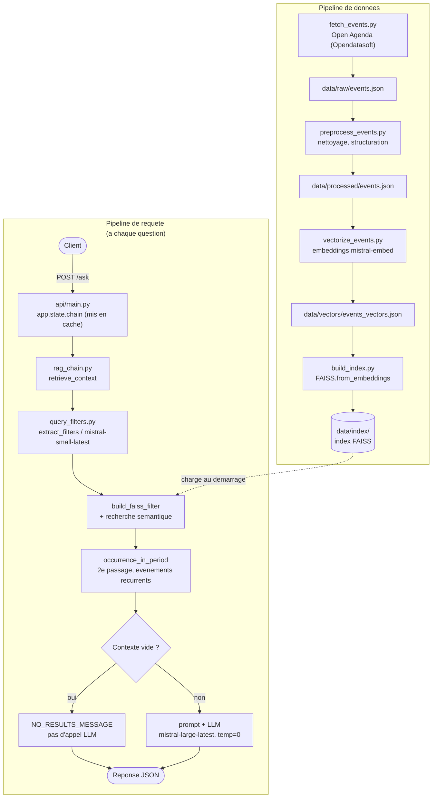
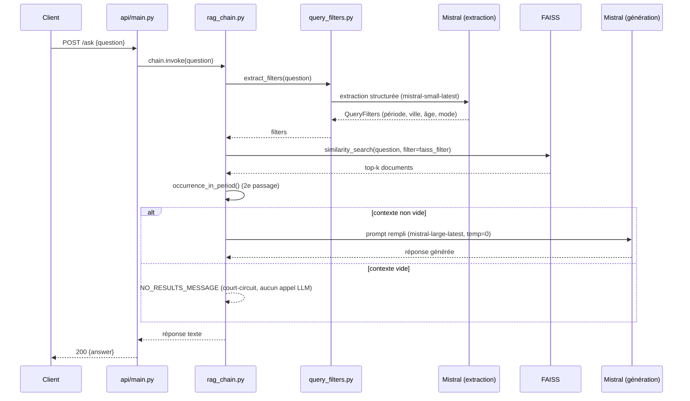

# Projet9 — POC Chatbot RAG pour Puls-Events

Dépôt GitHub : [github.com/FaizaKh93/Projet9_mission](https://github.com/FaizaKh93/Projet9_mission)

POC d'un chatbot capable de répondre à des questions sur des événements culturels à venir, à partir des données de l'[API Open Agenda](https://openagenda.com/), en s'appuyant sur un système RAG (Retrieval-Augmented Generation) combinant recherche vectorielle (FAISS) et génération de réponse en langage naturel (Mistral) orchestrés via LangChain, exposé par une API REST (FastAPI).

# Structure du projet

```
notebooks/   notebooks d'exploration et de vérification (ex. 00_check_environment.ipynb)
scripts/     scripts du pipeline de données (récupération, nettoyage, indexation)
api/         API REST FastAPI exposant le système RAG
eval/        évaluation Ragas du RAG (jeu de test annoté, script d'évaluation) — voir plus bas
tests/       tests automatisés (pytest) : préprocessing et API
Dockerfile   conteneurise l'API — voir section "Conteneurisation" plus bas
postman_collection.json   collection Postman des routes de l'API — voir section "API REST" plus bas
```

# Architecture

Deux pipelines distincts : un pipeline de données (hors ligne, lancé manuellement ou via `POST /rebuild`) qui construit l'index vectoriel, et un pipeline de requête (à chaque question) qui l'interroge. Le second est protégé par les mêmes règles déterministes détaillées dans la section "Chaîne RAG" plus bas — extraction de filtres, dates, anti-hallucination.

Rôle de chaque composant :

- `fetch_events.py` — récupère les événements bruts (API Opendatasoft / Open Agenda)
- `preprocess_events.py` — nettoie et structure les données
- `vectorize_events.py` — découpe en chunks et calcule les embeddings (`mistral-embed`)
- `build_index.py` — construit l'index vectoriel FAISS
- `query_filters.py` — extrait les filtres d'une question et calcule les dates/périodes
- `rag_chain.py` — assemble recherche + génération, gère l'anti-hallucination
- `api/main.py` — expose le tout en REST (FastAPI)

Composants autour du pipeline RAG, chacun détaillé dans sa propre section plus bas :

- `eval/evaluate_rag.py` — évaluation Ragas du RAG sur un jeu de test annoté (voir "Évaluation (Ragas)")
- `tests/*.py` — suite de tests automatisés (voir "Tests")
- `Dockerfile` — conteneurise l'API (voir "Conteneurisation")
- `.github/workflows/tests.yml` — exécute les tests à chaque push/PR (voir "Intégration continue (GitHub Actions)")



Déroulé détaillé d'un `POST /ask` (diagramme de séquence) :



# Reproduction de l'environnement

Prérequis : [uv](https://docs.astral.sh/uv/) installé, Python géré automatiquement par uv (version pinnée dans `.python-version`).

```bash
git clone https://github.com/FaizaKh93/Projet9_mission.git
cd Projet9_mission
uv sync
```

`uv sync` recrée l'environnement virtuel `.venv/` et installe exactement les versions verrouillées dans `uv.lock`.

## Clé API Mistral

```bash
cp .env.example .env
```

Puis renseigner votre propre clé dans `.env` (jamais commité) :

```
MISTRAL_API_KEY=votre_clé
```

Pour utiliser l'API (voir plus bas), renseigner aussi `X_API_KEY` dans ce même `.env` — une valeur de VOTRE choix (pas fournie par Mistral), servant de mot de passe pour déclencher `POST /rebuild`. Sans elle, `POST /rebuild` répond systématiquement `401 Unauthorized` (voir `verify_admin_key()` dans `api/main.py`) :

```
X_API_KEY=votre_secret_au_choix
```

## Vérifier l'installation

```bash
uv run jupyter notebook notebooks/00_check_environment.ipynb
```

Toutes les cellules doivent s'exécuter sans erreur (faiss, langchain_community, langchain_huggingface, mistralai, fastapi).

# Pipeline de données

Pas de reconstruction automatique de l'index pour ce POC : les scripts se lancent manuellement, dans l'ordre, avant de démarrer l'API.

```bash
uv run python scripts/fetch_events.py
```

Récupère les événements culturels des Bouches-du-Rhône de moins d'un an (source : [miroir Opendatasoft des données Open Agenda](https://public.opendatasoft.com/explore/dataset/evenements-publics-openagenda/), aucune clé API requise) et les sauvegarde dans `data/raw/events.json`. Résilient aux pannes réseau transitoires : `fetch_page()` réessaie automatiquement (jusqu'à 3 fois, délai croissant) via `tenacity` avant d'abandonner.

```bash
uv run python scripts/preprocess_events.py
```

Nettoie et structure les événements bruts : exclut les sources hors-sujet (forums emploi France Travail, ~49% du volume brut) et les événements incomplets ou mal géocodés (texte vide, date/uid manquants, code postal hors Bouches-du-Rhône, présentiel sans aucune localisation, en ligne sans lien d'accès), normalise la casse des noms de ville, extrait les champs utiles (dates, lieu, tarifs, âge, accessibilité, contact...) et construit le texte à vectoriser. Écrit le résultat dans `data/processed/events.json`.

**Répartition des champs bruts (56) vers `data/processed/events.json` (24 champs structurés + 1 champ texte vectorisé, 25 champs au total) :**

| Champ | Où | Pourquoi |
|---|---|---|
| `uid`, `url`, `date_start`, `date_end` | Structuré | Identifiants/dates exacts, fiables |
| `occurrences` | Structuré | Liste des créneaux individuels d'un événement récurrent (extraite du champ brut `timings`) — `date_start`/`date_end` ne donnent que la 1ère et la dernière occurrence, insuffisant pour savoir laquelle est encore à venir ou si une occurrence tombe réellement dans une période demandée (voir "Chaîne RAG", plus bas) |
| `status` | Les deux | Structuré pour filtrage exact ; ajouté au texte seulement si ≠ "Programmé" (annulé/reprogrammé), pour que le LLM puisse répondre "cet événement est-il maintenu ?" |
| `attendance_mode` | Structuré | Sur place / En ligne / Mixte — filtrage exact (recherche hybride, voir "Chaîne RAG") |
| `location_city` | Structuré | Filtrage exact (recherche hybride) + affiché |
| `location_name`, `location_district` | Les deux | Noms propres qu'une question peut citer directement (ex. "à la médiathèque Louis Aragon"), utiles à la recherche sémantique — ET affichés (bloc "Établissement") pour préciser le lieu au-delà de la seule ville |
| `location_address`, `location_postalcode`, `location_phone`, `location_website`, `location_links`, `registration_link`, `online_access_link` | Structuré | Contact/pratique — affichés tels quels dans le contexte transmis au LLM (`format_docs()`) quand renseignés, jamais vectorisés (aucune valeur de recherche sémantique) |
| `location_insee` | Structuré | Passé tel quel depuis les données brutes ; utilisé une fois en exploration (`notebooks/01_raw_data_exploration.ipynb`) pour vérifier la cohérence `location_city`/code INSEE, mais pas exploité par le pipeline actif (`build_known_cities()` ne compare que `location_city`/`location_postalcode`) — jamais affiché ni vectorisé |
| `age_min`, `age_max` | Structuré | Filtrage exact ("pour un enfant de 8 ans ?") — gardés malgré une faible fréquence de remplissage |
| `accessibility_labels` | Les deux | Métadonnée en LISTE, structurée ET ajoutée au texte — mais jamais utilisée comme filtre exact : le filtre FAISS (`$in`) ne sait vérifier qu'une valeur scalaire parmi une liste acceptée, pas l'inverse ("cette liste contient-elle X ?"). Seule la recherche sémantique sur une formulation libre ("accessible en fauteuil roulant") l'exploite réellement, d'où sa présence dans le texte vectorisé |
| `conditions` (tarifs) | Les deux | Structuré pour affichage exact, ET ajouté au texte pour la recherche sémantique ("événements gratuits") |
| `keywords` | Les deux | Structuré (liste), ET ajoutés au texte pour renforcer le matching sémantique |
| `title` | Les deux | Affichage en métadonnée, ET ajouté en tête du texte vectorisé pour la correspondance sur le nom de l'événement |
| `description_fr` / `longdescription_fr` | Vectorisé | Contenu libre, recherche sémantique |

Exclus, avec une vraie raison à chaque fois :
- `category`, `country_fr`, `location_countrycode` — constants/vides sur tout le dataset, aucune information
- `contributor_email`, `contributor_contactnumber`, `contributor_contactname`, `contributor_contactposition`, `contributor_organization` — données du contributeur, pas de place dans une donnée exposée publiquement par un chatbot
- `slug`, `location_uid`, `originagenda_uid` — identifiants internes à la plateforme, sans valeur pour répondre à une question
- `image`, `imagecredits`, `originalimage`, `location_image`, `location_imagecredits`, `thumbnail` — médias, non exploités par cette API (pas de diffusion d'images à ce stade)
- `accessibility` — doublon brut de `accessibility_label_fr` (libellés lisibles), déjà repris via ce dernier
- `daterange_fr`, `firstdate_end`, `lastdate_begin` — variantes/doublons de `firstdate_begin`/`lastdate_end`, déjà repris en `date_start`/`date_end`
- `location_access_fr`, `location_description_fr`, `location_coordinates`, `location_department`, `location_region`, `location_tags` — informations de localisation redondantes avec les champs déjà gardés (`location_city`, `location_address`, `location_district`...) ou hors du périmètre utile à ce POC
- `links` (racine, différent de `location_links`), `updatedat` — aucun usage identifié pour répondre à une question

```bash
uv run python scripts/vectorize_events.py
```

Découpe le texte de chaque événement en chunks (`langchain_text_splitters`, les textes courts ne produisent le plus souvent qu'un seul chunk) et génère leurs embeddings via l'API Mistral (`mistral-embed`, payant — nécessite `MISTRAL_API_KEY` dans `.env`). Sauvegarde le résultat dans `data/vectors/events_vectors.json`, prêt à être indexé, sans construire l'index FAISS lui-même (fait par `build_index.py`, juste après). Coût estimé sur ce dataset : ~0,08 $ pour 4241 événements — chiffres donnés à titre indicatif : `fetch_events.py` filtre sur "moins d'un an" par rapport à la date du jour, donc le nombre d'événements (et le coût) évolue à chaque rafraîchissement des données (relance manuelle des scripts, ou `POST /rebuild`).

```bash
uv run python scripts/build_index.py
```

Construit l'index vectoriel FAISS à partir des vecteurs déjà calculés par `vectorize_events.py` (`FAISS.from_embeddings()`, aucun nouvel appel à Mistral), sauvegardé dans `data/index/` (`index.faiss` + `index.pkl`). Vérifie que le nombre de vecteurs indexés correspond au nombre de vecteurs chargés.

```bash
uv run jupyter notebook notebooks/04_search_evaluation.ipynb
```

Charge l'index et teste 5 questions représentatives (thème+lieu, filtre prix implicite, thème culturel différent, statut "Annulé", requête hors-sujet) pour vérifier la pertinence des résultats — la demande explicite du brief ("tests de recherche pour vérifier l'efficacité").

# Chaîne RAG

`scripts/query_filters.py` + `scripts/rag_chain.py` assemblent la recherche et la génération. La recherche est **hybride** : une recherche purement sémantique ne sait pas comparer une date à aujourd'hui, ce qui produisait de mauvaises réponses sur des questions temporelles ("ce week-end" renvoyait des événements passés ou le mauvais week-end). `query_filters.py` extrait de la question, via `mistral-small-latest` (`with_structured_output`), les critères explicitement exprimés — période, ville, âge, mode de participation — puis `rag_chain.py` convertit ces critères en filtre FAISS (`similarity_search(question, filter=..., fetch_k=<taille totale de l'index>)`), appliqué **en plus de** la recherche sémantique, pas à sa place :
- la période ("ce week-end", "cette semaine"...) est convertie en plage de dates par calcul Python déterministe (`timedelta`), jamais par le LLM — peu fiable pour calculer une vraie plage de dates ;
- `fetch_k` est monté à la taille totale de l'index car le filtre FAISS s'applique *après* la recherche par similarité, pas comme un pré-filtre — sans cela, le filtre pourrait n'avoir aucun événement valide à examiner ;
- le filtre sur les dates compare `date_end`/`date_start` par CHEVAUCHEMENT, pas seulement `date_start` seul, pour garder un événement déjà commencé mais encore en cours pendant la période demandée ;
- sans période précisée, un filtre par défaut `date_end >= aujourd'hui` s'applique quand même — un événement terminé n'est jamais une réponse valable, et ce tri ne peut pas être laissé au LLM (peu fiable pour comparer une date à aujourd'hui, même avec la date du jour fournie dans le prompt).

**Événements récurrents** : `date_start`/`date_end` ne représentent que la 1ère et la dernière occurrence d'un événement récurrent (ex. un atelier chaque samedi d'avril à juin) — insuffisant pour l'affichage ET le filtrage, corrigés séparément : `next_occurrence_date()` (rag_chain.py) calcule la prochaine date pertinente à afficher ; `occurrence_in_period()` (query_filters.py) revérifie après la recherche FAISS qu'une occurrence réelle tombe dans la période demandée (le filtre FAISS seul, sur `date_start`/`date_end`, pourrait laisser passer à tort un événement aux occurrences espacées, ex. avril puis octobre pour une question sur juin). Limite assumée : ce second contrôle s'applique après que la recherche a déjà limité les résultats à `k` documents — un événement écarté à ce stade n'est pas remplacé par un autre candidat plus bas dans le classement.

`format_docs()` (rag_chain.py) met en forme le contexte transmis au LLM : titre, date (calculée en français par `format_date_fr()`, jamais laissée au LLM, qui s'est trompé en la déduisant lui-même d'une date ISO brute), lieu, tarif, établissement, adresse, contact, inscription, accès en ligne — chaque champ optionnel n'apparaît que s'il est renseigné, pour éviter qu'un champ manquant (`None`) apparaisse littéralement dans le prompt.

**Bugs trouvés et corrigés en testant/évaluant le système :**

| Bug | Trouvé via | Cause | Correction |
|---|---|---|---|
| Hallucination sur un contexte vide (ex. "événements à Paris") — récidivé une 1re fois après un correctif textuel, puis une 2e fois pendant l'évaluation Ragas | Test du déploiement Docker, puis `eval/eval_results.json` | Une consigne textuelle seule ne garantit pas un comportement à 100% des appels, même à `temperature=0` — le LLM comble un contexte VRAIMENT vide avec sa propre connaissance | Court-circuit déterministe en Python (`generate_or_refuse()`) : `NO_RESULTS_MESSAGE` renvoyé directement si le contexte est vide, sans appeler le LLM |
| Ville mal filtrée par une casse inhabituelle (ex. "Aix-En-Provence") | Diagnostic du contexte vide (`eval/diagnose_hallucination.py`) | `extract_filters()` reprend la casse telle qu'écrite par l'utilisateur ; le filtre FAISS (`$eq`) compare des chaînes strictement égales | `normalize_location_city()` recale la ville sur sa casse exacte dans les données, comparaison insensible à la casse |
| Date affichée incohérente avec la période demandée (ex. "dimanche prochain") | Faux négatif creusé avec `eval/diagnose_hallucination.py` étendu | `next_occurrence_date()` affichait toujours l'occurrence la plus proche d'aujourd'hui, jamais celle de la période demandée | `date_range` transmis à `next_occurrence_date()`/`format_docs()` — priorité à une occurrence dans la période demandée |
| Jour de semaine cité seul (ex. "mercredi", "ce samedi") mal interprété | Constaté empiriquement (fiable un appel sur deux) | Ne correspondait à aucune des 4 catégories de `QueryFilters.period` | 7 jours ajoutés comme catégories à part entière + `build_period_note()` transmet la date déjà résolue au LLM |

Deux précisions qui ne tenaient pas dans le tableau : la consigne anti-hallucination ne nomme jamais "Bouches-du-Rhône" — la nommer risquerait d'inciter le LLM à halluciner des réponses *plausibles pour cette région précise*, plus difficiles à détecter qu'une hallucination sur Paris. Et `ce_mois`/`cette_semaine` partagent le même principe que le filtre par défaut : jamais avant aujourd'hui, même si le début théorique de la période (1er du mois, lundi de la semaine) est déjà passé.

**Limite connue, non traitée à ce stade** : la chaîne est *stateless* — `chain.invoke(question)` ne connaît que la question du tour actuel, aucun historique de conversation n'est conservé (voir "Perspectives").

```bash
uv run jupyter notebook notebooks/05_rag_chain_evaluation.ipynb
```

Teste 6 scénarios représentatifs sur la chaîne complète (thème+lieu, contrainte de prix, question multi-contraintes, événement annulé signalé comme tel dans la réponse, question hors-sujet, question temporelle ambiguë) — nécessite `MISTRAL_API_KEY` (génération payante).

# API REST

```bash
uv run uvicorn api.main:app --reload
```

Démarre l'API sur `http://127.0.0.1:8000`. Documentation Swagger interactive générée automatiquement sur `http://127.0.0.1:8000/docs`. La chaîne RAG est construite **une seule fois**, au démarrage du serveur (`lifespan`, voir `api/main.py`) — chaque appel à `/ask` réutilise cette même chaîne, sans recharger l'index FAISS ni recréer les clients Mistral à chaque requête.

| Route | Méthode | Description |
|---|---|---|
| `/` | GET | Informations générales, pointeur vers `/docs`. |
| `/health` | GET | Vérification de disponibilité du serveur, indépendante de l'état de la chaîne RAG. |
| `/metadata` | GET | État des données actuellement en mémoire (`events_indexed`, `geographic_coverage`, `chain_available`) — pas de clé requise. Différent de `GET /rebuild` : reflète les données réellement chargées (mis à jour à chaque construction de la chaîne), pas l'état du processus de reconstruction. Après un `POST /rebuild`, attendre `"state": "done"` sur `GET /rebuild` avant de voir le nouveau compte ici. |
| `/ask` | POST | Corps `{"question": "..."}` → réponse générée. `422` si la question est vide/absente, `503` si la chaîne n'a pas pu être construite au démarrage, `502` en cas d'échec du service Mistral. |
| `/rebuild` | POST | **Nécessite l'en-tête HTTP `X-API-Key`**, avec la valeur de `X_API_KEY` définie dans `.env` — sans elle, `401 Unauthorized`. Relance le pipeline complet (`fetch_events` → `preprocess_events` → `vectorize_events` → `build_index`) en tâche de fond et recharge la chaîne RAG, sans redémarrer le serveur. Répond immédiatement `202 Accepted`, sans attendre la fin du pipeline (plusieurs minutes, appel payant à Mistral). `409 Conflict` si un rebuild est déjà en cours. |
| `/rebuild` | GET | Consulte l'état de la dernière reconstruction (`idle`/`running`/`done`/`error`) — pas de clé requise, lecture seule. |

**Exemples curl** (serveur démarré en local, voir plus haut) :

```bash
curl http://127.0.0.1:8000/health
```

```bash
curl http://127.0.0.1:8000/metadata
```

```bash
curl -X POST http://127.0.0.1:8000/ask \
  -H "Content-Type: application/json" \
  -d '{"question": "Quels concerts de musique classique y a-t-il à Marseille ?"}'
```

```bash
curl -X POST http://127.0.0.1:8000/rebuild \
  -H "X-API-Key: <valeur de X_API_KEY dans .env>"
```

```bash
curl http://127.0.0.1:8000/rebuild
```

**Exemple Python** (`requests`, déjà présent dans les dépendances transitives — sinon `uv add requests`) :

```python
import requests

response = requests.post(
    "http://127.0.0.1:8000/ask",
    json={"question": "Quels concerts de musique classique y a-t-il à Marseille ?"},
)
response.raise_for_status()
print(response.json()["answer"])
```

**Collection Postman** : `postman_collection.json` (à la racine du repo) — les 5 routes ci-dessus prêtes à importer (`Import` dans Postman). Le header `X-API-Key` contient un texte de substitution (`<votre X_API_KEY>`), pas une vraie clé — à remplacer par votre propre valeur après import, jamais commitée ici.

# Conteneurisation

`Dockerfile` conteneurise uniquement l'**API** (`api/main.py`) — pas le pipeline de données. `scripts/fetch_events.py`/`preprocess_events.py`/`vectorize_events.py`/`build_index.py` continuent de tourner hors Docker, comme avant (en local, ou via `POST /rebuild` qui les exécute à l'intérieur du conteneur en cours d'exécution).

**Choix délibéré : l'index FAISS (`data/index/`) n'est jamais intégré à l'image, il est monté en volume au lancement.** L'alternative (l'intégrer au `docker build`) est écartée pour deux raisons : elle exposerait `MISTRAL_API_KEY` à la machine de build (même avec les "build secrets" de BuildKit, qui protègent l'image finale mais pas la machine qui construit), et elle obligerait à reconstruire toute l'image à chaque rafraîchissement de données plutôt qu'un simple `POST /rebuild`.

```bash
docker build -t projet9-rag-api .
```

```bash
docker run -p 8000:8000 --env-file .env -v "$(pwd)/data:/app/data" projet9-rag-api
```

- `-p 8000:8000` — relie le port 8000 du conteneur à celui de la machine hôte (`http://localhost:8000/docs`, pas `http://0.0.0.0:8000` — cette dernière adresse n'existe que du point de vue du serveur à l'intérieur du conteneur, jamais joignable depuis l'extérieur).
- `--env-file .env` — transmet `MISTRAL_API_KEY`/`X_API_KEY` au conteneur au lancement ; aucune clé n'est jamais copiée dans l'image (ni au build, ni dans une couche).
- `-v "$(pwd)/data:/app/data"` — monte tout le dossier `data/` local (y compris l'index déjà construit) au chemin attendu par les scripts à l'intérieur du conteneur.

**Sous Git Bash (MINGW64) sur Windows**, la conversion automatique de chemin de Git Bash peut casser la syntaxe `-v hôte:conteneur` de Docker — si le volume ne se monte pas correctement (erreur FAISS "could not open .../index.faiss", alors que le fichier existe bien côté hôte), préfixer la commande avec `MSYS_NO_PATHCONV=1` :

```bash
MSYS_NO_PATHCONV=1 docker run -p 8000:8000 --env-file .env -v "$(pwd)/data:/app/data" projet9-rag-api
```

# Tests

```bash
uv run pytest tests/ -v
```

`tests/test_preprocessing.py` teste la logique de `preprocess_events.py` (exclusion France Travail, normalisation de casse, extraction du statut, structuration des champs, extraction des occurrences) sur des événements factices — ne nécessite pas d'avoir lancé `fetch_events.py` au préalable.

`tests/test_api.py` teste l'API (`api/main.py`) via `TestClient` : routing, validation Pydantic, codes d'erreur (422/401/409/502/503), protection de `/rebuild`. Les appels coûteux (Mistral, pipeline complet) sont mockés — `lifespan()` s'exécute réellement au démarrage de chaque test (tentative de chargement de l'index FAISS depuis le disque), mais son propre `try/except` absorbe un échec (ex. `data/index/` absent) en `app.state.chain = None` sans jamais faire planter le serveur : vérifié empiriquement, ce fichier tourne sans erreur même sans aucune donnée sur disque, chaque test remplaçant de toute façon `app.state.chain` explicitement si besoin.

`tests/test_query_filters.py` et `tests/test_rag_chain.py` testent la logique pure de `query_filters.py` (calcul de périodes — dont les 7 jours de la semaine cités seuls —, filtre FAISS, vérification des occurrences) et de `rag_chain.py` (formatage des dates, sélection de la prochaine occurrence, résolution de la période en note pour le LLM via `build_period_note()`, mise en forme du contexte) — aucune dépendance à Mistral ou FAISS, entièrement déterministes. Seule exception : les tests de `normalize_location_city()` lisent normalement `data/processed/events.json` pour connaître la casse réelle des villes — la fixture `fake_processed_events` (redirige `PROCESSED_PATH` vers un petit fichier JSON factice via `monkeypatch`) les en affranchit aussi.

`tests/test_fetch_events.py` et `tests/test_vectorize_events.py` testent `fetch_events.py` et `vectorize_events.py`, appels réseau/API inclus — un choix différent du reste du projet (voir juste en dessous) : `httpx.get()` est mocké (pagination simulée sur plusieurs pages factices, et retry testé en simulant un échec suivi d'un succès) et `MistralAIEmbeddings` est remplacé par une classe factice (`embed_documents()` renvoie des vecteurs fixes), sans clé API ni appel réel. Ce mock est jugé représentatif ici parce que le comportement à vérifier (pagination, retry, assemblage chunk_id/texte/métadonnée/vecteur) est purement mécanique et ne dépend pas de la qualité d'une réponse — contrairement à mocker une génération Mistral, dont la valeur réelle ne se résume pas à sa structure (cf. `retrieve_context()` ci-dessous, volontairement non mocké).

Fonctions volontairement non testées unitairement (appels réseau réels — Mistral et/ou disque, dont la qualité de réponse ne peut pas être vérifiée par un mock) : `build_index.py`, `preprocess_events.py::load_raw_events`, `query_filters.py::extract_filters`, `rag_chain.py::retrieve_context`/`answer_question`. Validées autrement, via `notebooks/04_search_evaluation.ipynb`/`05_rag_chain_evaluation.ipynb` et l'exécution réelle du pipeline complet.

Rapport de couverture (nécessite `pytest-cov`, dépendance de dev déjà installée) :

```bash
uv run pytest tests/ --cov=scripts --cov=api --cov-report=html
```

Génère `htmlcov/index.html` (gitignoré, régénérable). Couverture répartie sans trou sur toute la logique testable unitairement (100% sur les fonctions pures citées ci-dessus), le reste correspondant aux appels réseau réels listés juste au-dessus — nombre de tests et pourcentage exact à régénérer via la commande ci-dessus (évoluent au fil des ajouts, non figés ici pour éviter un chiffre obsolète).

# Intégration continue (GitHub Actions)

`.github/workflows/tests.yml` relance toute la suite (`uv run pytest tests/ -v`) à chaque push et pull request. Aucun secret requis : ni `MISTRAL_API_KEY` ni les données du pipeline (`data/`, gitignorées) ne sont nécessaires — vérifié empiriquement en renommant temporairement `data/index/` et `data/processed/` en local, les fichiers de test passent intégralement sans eux, grâce au garde-fou de `lifespan()` et à `fake_processed_events` décrits dans "Tests" ci-dessus.

# Évaluation (Ragas)

`eval/qa_dataset_manual.json` — jeu de test annoté, entièrement écrit et vérifié à la main contre `data/processed/events.json` (pas généré), seul fichier consommé par `evaluate_rag.py`. Chaque paire question/réponse de référence porte un `source_event_uids` (liste, vide pour les questions hors-sujet/hors-zone géographique où aucun événement source n'est attendu) pointant vers le ou les événements réels utilisés pour écrire la réponse — traçabilité vérifiable, pas une réponse inventée. Les paires dont la réponse dépend de la date du jour portent aussi `time_sensitive: true` et `verified_on` (date de vérification), pour rester honnête sur leur péremption possible.

**`eval/generate_testset.py` — alternative explorée puis abandonnée** (conservée à titre de documentation, voir son docstring ; sa sortie `eval/qa_dataset_generated.json`, 14 paires, gardée comme trace historique, non utilisée par `evaluate_rag.py`). Génère des paires via `TestsetGenerator` de Ragas, à partir de vrais documents du dataset — abandonnée pour deux raisons : (1) la génération ignore la fraîcheur des événements piochés (10/14 déjà passés au moment de l'évaluation, invalidant tout chatbot fidèle à sa consigne anti-hallucination) ; (2) Ragas ne renvoie aucun lien vers l'événement source, et les nombreux doublons du dataset (même activité reconduite à plusieurs dates) ont fait échouer un matching automatique par mots-clés sur plusieurs paires.

`eval/evaluate_rag.py` — exécute la chaîne RAG (retrieval + génération, comme `rag_chain.py`) sur chaque question de `qa_dataset_manual.json` et calcule 4 métriques Ragas : `faithfulness` (ancrage au contexte récupéré), `answer_relevancy` (pertinence à la question), `context_recall` et `answer_correctness` (les deux dernières comparées au ground truth). Contourne 3 bugs réels de `ragas==0.4.3` avec Mistral, vérifiés empiriquement (détail en commentaire à chaque contournement dans le fichier) : import `ChatVertexAI` cassé, API "collections" incompatible avec le client Mistral, combinaison de `token_usage` cassée dans `langchain_mistralai` au-delà d'une génération combinée. Sauvegarde incrémentale dans `eval/eval_results.json` (question par question, pas seulement à la fin) — un plantage (ex. limite de débit de l'API Mistral, déjà rencontrée) ne fait alors perdre que la question en cours.

```bash
uv run python eval/evaluate_rag.py
```

`notebooks/06_rag_evaluation.ipynb` charge `eval/eval_results.json` (résultats déjà calculés, pas de nouvel appel Mistral) pour une présentation lisible des scores.

Chaque `source_event_uids` de `qa_dataset_manual.json` a été vérifié à la main contre l'événement réel correspondant dans `data/processed/events.json` (titre, dates, tarif, texte) au moment de la rédaction du jeu de test — pas juste supposé correct.

## Résultats de l'évaluation

Moyennes sur les 15 questions de `qa_dataset_manual.json` (`eval/eval_results.json`) :

| Métrique | Moyenne |
|---|---|
| Faithfulness | 0.71 |
| Answer relevancy | 0.69 |
| Context recall | 0.23 |
| Answer correctness | 0.40 |

**Faithfulness** et **answer relevancy** sont les deux métriques les plus interprétables ici : elles jugent la réponse par rapport au contexte réellement récupéré, pas par rapport à une seule réponse de référence. 0.71 est correct mais tiré vers le bas par 3 questions à 0.32–0.33 (à investiguer : affirmations reformulées non retrouvées telles quelles dans le contexte par le juge Ragas) et 2 questions à 0.0 sur des réponses de refus (« Quels événements y a-t-il à Paris ? », « Quelle est la recette d'un bon gâteau au chocolat ? ») — un refus ne contient aucune affirmation factuelle à vérifier, la métrique n'est donc pas interprétable dans ce cas précis (limite connue de Ragas sur ce type de réponse, pas un signe de mauvaise réponse : ce sont justement les deux comportements attendus, hors-zone et hors-sujet).

**Context recall** et **answer correctness** sont structurellement bas, et c'est attendu plutôt qu'un signe de mauvaise qualité : ces deux métriques comparent la réponse à LA SEULE `reference_answer` du jeu de test, qui ne cite qu'un exemple réel parmi plusieurs événements valides pour les questions larges (ex. « Qu'est-ce qu'il y a à faire à Marseille ce mois-ci ? »). Le chatbot répond alors avec d'autres événements tout aussi valides mais absents de cette référence unique — d'où un score bas malgré une réponse correcte, vérifié manuellement en comparant plusieurs réponses générées aux données réelles.

**Limite à noter** : le juge Ragas (LLM) n'est pas parfaitement déterministe même à `temperature=0` — deux exécutions successives sur les mêmes réponses générées (texte identique) ont donné des scores de faithfulness différents pour 3 questions (ex. 0.90 puis 0.32 pour la même réponse). Les scores ci-dessus donnent donc un ordre de grandeur, pas une mesure à la décimale près.

**Taux de réponse acceptable** : 10/13 (77%) des questions jugeables ont faithfulness ET answer_relevancy ≥ 0.7 (seuil robuste : net écart entre 0.32–0.33 et 0.89+). Les 2 questions hors-zone/hors-sujet sont exclues du calcul — leur refus correct donne un faithfulness/answer_relevancy à 0.0 non interprétable, pas un échec (voir plus haut). Détail reproductible dans `notebooks/06_rag_evaluation.ipynb`.

**Couverture des événements** : pas mesurée comme une métrique séparée — `context_recall` en tient déjà lieu au niveau du jeu de test (est-ce que les bons événements source sont bien retrouvés pour chaque question), voir plus haut. Une vraie mesure de couverture du corpus entier (quelle proportion des 4241 événements est un jour réellement retrouvable par une question) demanderait une analyse bien plus lourde, hors du périmètre de ce POC.

# Perspectives

- **Mémoire conversationnelle** — Ajouter un historique de conversation à la chaîne (ex. `RunnableWithMessageHistory` de LangChain, qui réinjecte les échanges précédents dans le prompt) pour résoudre les questions de suivi comme "l'url de cet événement ?".
- **Rafraîchissement automatique** — Programmer l'appel à `POST /rebuild` sur un intervalle régulier (ex. un workflow GitHub Actions déclenché chaque nuit via `on: schedule`) pour garder la base à jour sans intervention manuelle.
- **Jeu de test élargi** — Étendre `qa_dataset_manual.json` au-delà de 15 questions (ex. ajouter des paires ciblant des combinaisons de filtres encore peu couvertes, comme ville + âge + mode ensemble).
- **Ground truth multi-référence** — Remplacer la réponse de référence unique par plusieurs réponses valides par question (ex. lister tous les `source_event_uids` acceptables au lieu d'un seul dans `qa_dataset_manual.json`) pour que `context_recall`/`answer_correctness` reflètent mieux les questions à plusieurs bonnes réponses.
- **Second juge Ragas** — Recalculer les mêmes métriques avec un second modèle comme juge (ex. relancer `evaluate_rag.py` en remplaçant le LLM évaluateur par un autre modèle) pour distinguer un vrai signal de qualité du bruit de non-déterminisme déjà constaté ci-dessus.
